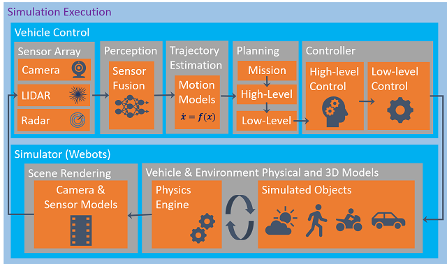
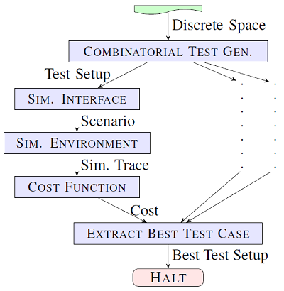
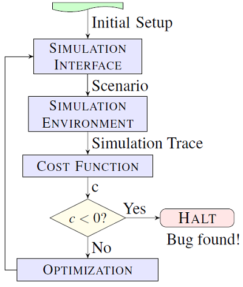
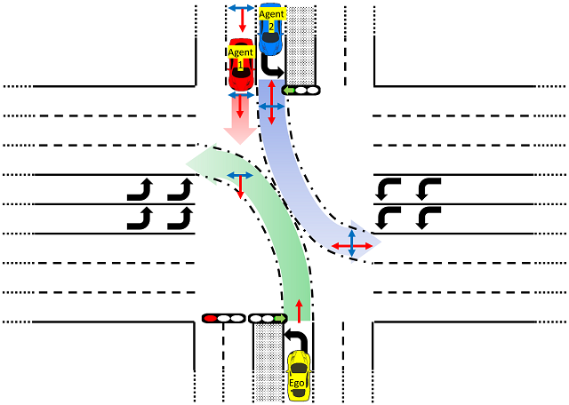
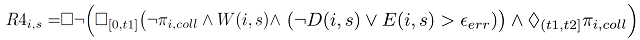

# **Sim-ATAV DOCUMENTATION**

You can reach Sim-ATAV git repo at [https://cpslab.assembla.com/spaces/sim-atav/git/source](https://cpslab.assembla.com/spaces/sim-atav/git/source)

Sim-ATAV documentation is available at [https://cpslab.assembla.com/spaces/sim-atav/wiki](https://cpslab.assembla.com/spaces/sim-atav/wiki)

Sim-ATAV is a Simulation-based Adversarial Test generation framework for Autonomous Vehicles (AV).  
It has been developed to experiment several testing and falsification approaches for AVs in a closed loop setting inside a simulated 3D world.  
The following publications provide more detail and we kindly suggest the user to consider citing those papers in their research.  

[1] *Simulation-based Adversarial Test Generation for Autonomous Vehicles with Machine Learning Components*  
C.E. Tuncali, G. Fainekos, H. Ito, J. Kapinski,  
IEEE Intelligent Vehicles Symposium, 2018  
[@arxiv](https://arxiv.org/abs/1804.06760)
[@staliro-references](https://sites.google.com/a/asu.edu/s-taliro/references)

[2] *Sim-ATAV: Simulation-Based Adversarial Testing Framework for Autonomous Vehicles*  
C.E. Tuncali, G. Fainekos, H. Ito, J. Kapinski,  
Proceedings of the 21st International Conference on Hybrid Systems: Computation and Control (part of CPS Week), 2018  
[@staliro-references](https://sites.google.com/a/asu.edu/s-taliro/references)

## Framework Overview

The simulation environment used in Sim-ATAV includes a vehicle perception system, a vehicle controller, a model of the physical environment, and a mechanism to render 2D images from 3D models. 
The framework uses freely available and low cost tools and can be run on a standard desktop PC. 
Sim-ATAV can be used to implement traditional testing approaches, as well as advanced automated testing approaches that were not previously possible using existing frameworks.

Sim-ATAV first generates test cases that correspond to scenarios defined in the simulation environment using covering arrays as a combinatorial test generation approach. 
The scenario setup is communicated to the simulation interface using TCP/IP sockets. 
After a simulation is executed, the corresponding simulation trace is received via socket communication and evaluated using a cost function. 
Among all discrete test cases, the most promising one is used as the initial test case for the falsification process shown below.

For falsification, the result obtained from the cost function is used in an optimization setting to generate the next scenario to be simulated.
For this purpose, Sim-ATAV uses [S-TaLiRo](https://sites.google.com/a/asu.edu/s-taliro/s-taliro), which is a MATLAB toolbox for falsification of Cyber-Physical Systems.

## Example Scenario

In this example scenario, the Ego vehicle is making a left turn at an intersection.
An agent vehicle (Agent 2) is also making a left turn from the other side of the intersection.
Another agent vehicle (Agent 1) is running a red light and creating a collision risk with the Ego vehicle.
Ego vehicle should be able to detect the Agent 1 and avoid a collision. 

We search for a set of parameter values that cause the perception system on the Ego vehicle to fail and result in a collision.
The parameters used in the test generation are:  

- Ego initial speed,  
- Ego initial distance to the intersection,  
- Agent 1 initial distance to the intersection,  
- Agent 1 initial speed,  
- Agent 1 speed when approaching the intersection,  
- Agent 1 speed inside the intersection,  
- Agent 1 initial lateral position,  
- Agent 1 target lateral position when approaching the intersection,  
- Agent 1 target lateral position inside the intersection,  
- Agent 2 initial lateral position,  
- Agent 2 speed,  
- Agent 2 initial distance to the intersection.  

#### Requirement
The requirement is that a single sensor error should not lead to a collision.
This requirement is represented in Signal Temporal Logic (STL) as follows:

The notation used in the requirement is:  
- \pi_{i,coll}: Collision with vehicle i.  
- W(i,s): Vehicle i is visible to the sensor s.  
- D(i,s): Object i is detected by the sensor s.  
- E(i,s): Quantification of the localization error for the vehicle i by the sensor s.  

#### Test results
Sim-ATAV successfully detected a falsifying case for this scenario.

A video of a case which is very close to falsification:  

A video of falsifying a case:  

## Installation Instructions  
This framework requires Python 3.7 and Webots for basic functionality.  
For some controllers and falsification approaches, there are other requirements like Matlab, S-TaLiRo, TensorFlow, SqueezeDet etc.  
The framework has been tested in Windows 10 with specific versions of the required packages. Please try other operating systems and package versions at your own risk. The framework should work in other operating systems however it may require some manual work  to collect all the python dependencies for the existing vehicle controllers in other OS.  
! For Windows, you can try setup_for_windows.bat that will guide you through installation process. This script is not advanced and may fail for some systems. If it fails, please try the steps below for a manual installation.
Below are the steps for the installation (In case you have problems during installation, you can find most package also in [Christoph Gohlke's website](https://www.lfd.uci.edu/~gohlke/pythonlibs/)):  
...  
**1.** Install [Python 3.7-64 Bit](https://www.python.org/)  
**2.** Install [Webots r2019a](https://www.cyberbotics.com/). 
**3.** (optional) If you have CUDA-enabled GPU and you would like to utilize it for increased performance:  
>a. Install [CUDA Toolkit 10.0](http://docs.nvidia.com/cuda/cuda-installation-guide-microsoft-windows/)  
b. Install [CUDNN 7.3.1](https://developer.nvidia.com/rdp/cudnn-download)  

**4.** Download Python_Dependencies from http://www.public.asu.edu/~etuncali/downloads/ and unzip it next to this installation script. You should have whl files directly under ./Python_Dependencies/  

**5.** Install commonly used python packages:  
>a. Install Numpy+MKL 1.14.6 either from Python Dependencies folder or from [Christoph Gohlke's website](https://www.lfd.uci.edu/~gohlke/pythonlibs/): *pip3 install --user --upgrade Python_Dependencies\numpy-1.14.6+mkl-cp37-cp37m-win_amd64.whl*  
b. Install scipy 1.2.0: *pip3 install scipy==1.2.0*  
c. Install scikit-learn: *pip3 install scikit-learn*  
d. Install pandas: *pip3 install pandas*  
e. Install Absl Py: *pip3 install absl-py*
f. Install matplotlib: *pip3 install matplotlib*
g. Install pykalman: *pip3 install pykalman*  
h. Install Shapely: *pip3 install Shapely*  
>>If you have problems installing Shapely, try to install the one from Python_Dependencies folder  :
	*pip3 install Python_Dependencies\Shapely-1.6.4.post1-cp37-cp37m-win_amd64.whl*
i. Install dubins: *pip3 install dubins*  
>>If you have issues installing pydubins:  
Either use the pydubins in the Python_Dependencies and call "python setup.py install" inside pydubins folder,  
or do the following:  
(i) Download pydubins from https://github.com/AndrewWalker/pydubins.  
(ii) Do the following changes in dubins/src/dubins.c:  
    #ifndef M_PI  
    #define M_PI 3.14159265358979323846  
    #endif  
(iii) Call "python setup.py install" inside pydubins folder.  

**6.** For controllers with DNN (Deep Neural Network) object detection:  
>Currently Python 3.7 support for Tensorflow is provided by 3rd party. Installation wheels are under Python_Dependencies folder.  
Check if your CPU supports AVX2 (for increased performance). A list of CPUs with AVX2 is here: https://en.wikipedia.org/wiki/Advanced_Vector_Extensions#CPUs_with_AVX2  
  a. If your GPU has CUDA cores, you have installed CUDNN and your CPU supports AVX 2: Install Tensorflow-gpu with AVX2 support.  
   *pip3 install --upgrade Python_Dependencies\tensorflow_gpu-1.12.0-cp37-cp37m-win_amd64.whl*  
  b. If your GPU has CUDA cores, you have installed CUDNN and your CPU does NOT support AVX 2: Install Tensorflow-gpu without AVX2 support.  
   *pip3 install --upgrade Python_Dependencies\sse2\tensorflow_gpu-1.12.0-cp37-cp37m-win_amd64.whl*  
  c. If your GPU does not have CUDA cores or you have not installed CUDNN and your CPU supports AVX 2: Install Tensorflow with AVX2 support.  
   *pip3 install --user --upgrade Python_Dependencies\tensorflow-1.12.0-cp37-cp37m-win_amd64.whl*  
  d. If your GPU does not have CUDA cores or you have not installed CUDNN and your CPU does NOT support AVX 2: Install Tensorflow without AVX2 support.  
   *pip3 install --user --upgrade Python_Dependencies\sse2\tensorflow-1.12.0-cp37-cp37m-win_amd64.whl* 
   
**7.** Install Python Dependencies of SqueezeDet (if you plan to use the existing controllers that use SqueezeDet). No need to install SqueezeDet separately as it is provided in the framework.  
> a. Install joblib: *pip3 install --upgrade joblib*  
b. Install opencv: *pip3 install --upgrade opencv-contrib-python*  
c. Install pillow: *pip3 install --upgrade Pillow*  
d. Install easydict: *pip3 install --upgrade easydict==1.7*  
>>If you have issues installing easydict, try the following:  
	(i) cd Python_Dependencies\easydict-1.7\
	(ii) python setup.py install
	(iii) cd ..\..

**8.** To design Covering Array Tests: Please request a copy and install ACTS from [NIST](https://csrc.nist.gov/projects/automated-combinatorial-testing-for-software/downloadable-tools#acts)  
**9.** To do robustness-guided falsification, you need Matlab and S-TaLiRo  
>a. Install [Matlab](https://www.mathworks.com/) (tested with r2017b).  
b. Install [S-TaLiRo](https://sites.google.com/a/asu.edu/s-taliro/s-taliro).  

**10.** After you are done with the installation, you can delete Python package wheel files that are under Python_Dependencies folder to save some disk space.  

## Configuring Existing Experiments to use CUDA-Enabled GPU
If your system has a CUDA-enabled GPU, and you have installed CUDA Toolkit and CUDNN, you need to set has_gpu=True in "Sim_ATAV\classifier\classifier_interface\gpu_check.py" to make the experiments use your GPU for SqueezeDet.

